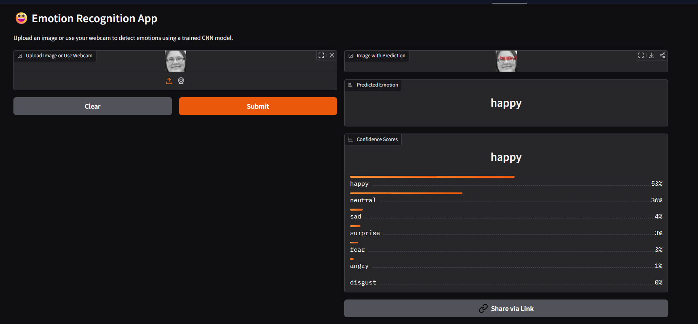

# 😃 Face Emotion Recognition using CNN

A deep learning project that classifies **human emotions from facial images** using a Convolutional Neural Network (CNN).  
The model can predict emotions such as **Angry, Disgust, Fear, Happy, Neutral, Sad, Surprise**.  
It also comes with a **Gradio Web App** for real-time testing via webcam or image upload. 🚀  

---

## 🔗 Live Demo
👉 Try it on Hugging Face Spaces: [Face Emotion Recognition CNN](https://huggingface.co/spaces/GokulV/Face_Emotion_Recognition_CNN)  

---

## 📂 Project Links
- **GitHub Repo:** [Face-Emotion-Recognition-CNN](https://github.com/Gokul-bit165/Face-Emotion-Recognition-CNN.git)  
- **Hugging Face Space:** [Live Demo](https://huggingface.co/spaces/GokulV/Face_Emotion_Recognition_CNN)  

---

## 📸 Demo Screenshots
> *(Replace with your actual app screenshots)*  

  

---

## ⚙️ Features
✅ CNN model trained on facial expression dataset  
✅ Classifies **7 emotions**: Angry, Disgust, Fear, Happy, Neutral, Sad, Surprise  
✅ Gradio-based UI for upload & webcam input  
✅ Shows predicted emotion + confidence scores + annotated image  
✅ Deployable on Hugging Face Spaces  

---

## 🛠 Installation & Setup

### 1️⃣ Clone the repo
```bash
git clone https://github.com/Gokul-bit165/Face-Emotion-Recognition-CNN.git
cd Face-Emotion-Recognition-CNN
```

### 2️⃣ Create a virtual environment
```bash
conda create -n emotion_cnn python=3.10 -y
conda activate emotion_cnn
```

### 3️⃣ Install dependencies
```bash
pip install -r requirements.txt
```

### 4️⃣ Run the app locally
```bash
python app.py
```
Now open 👉 `http://127.0.0.1:7860` in your browser.

---

## 📦 Requirements
Main dependencies:
- Python 3.9–3.11  
- TensorFlow / Keras  
- OpenCV  
- Gradio  
- NumPy, Pillow, Matplotlib  

(See `requirements.txt` for full list.)

---

## 📊 Training
Model was trained on a facial expression dataset using CNN.  
Example training command:
```python
python train.py
```

You can customize:
- Epochs  
- Learning rate  
- Optimizer (Adam, RMSprop, etc.)  

The final trained model is saved as `emotion_model.h5`.

---

## 🚀 Deployment
- **Locally**: Run `app.py` with Gradio  
- **Hugging Face Spaces**: Already deployed → [here](https://huggingface.co/spaces/GokulV/Face_Emotion_Recognition_CNN)  

---

## 👨‍💻 Author
- **Gokul V**  
- GitHub: [@Gokul-bit165](https://github.com/Gokul-bit165)  
- Hugging Face: [@GokulV](https://huggingface.co/GokulV)  

---

## ⭐ Contributing
Pull requests are welcome! If you’d like to improve accuracy, UI, or add new features, feel free to fork and contribute.

---

## 📜 License
This project is licensed under the MIT License.
